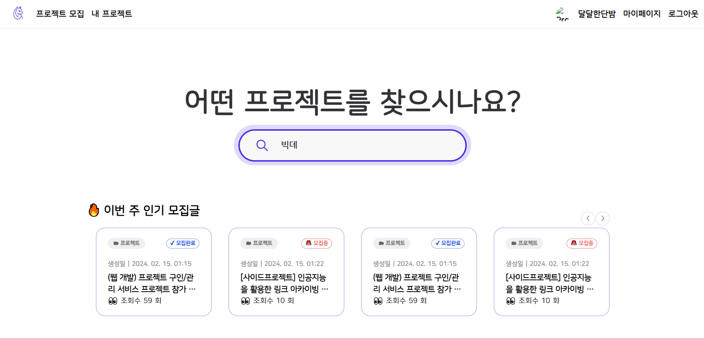
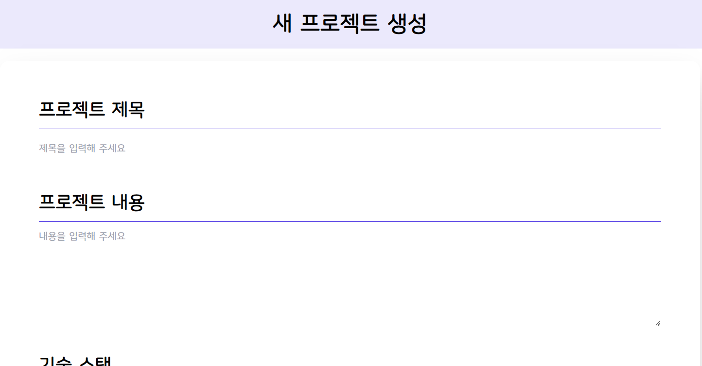
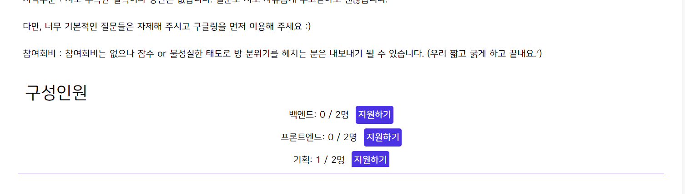
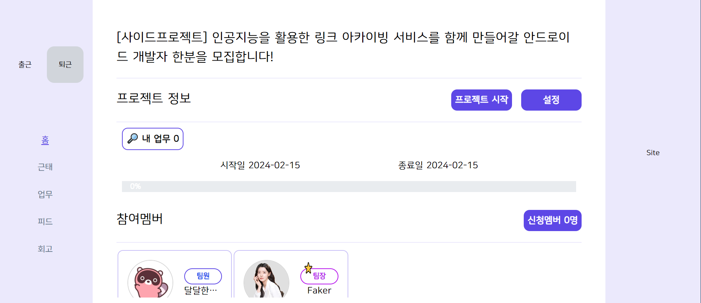
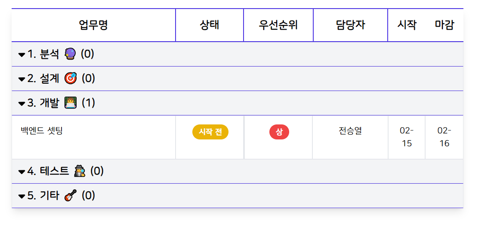
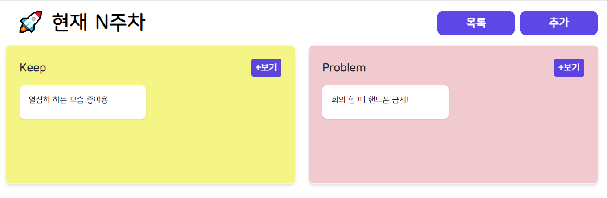
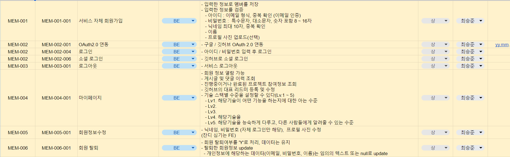
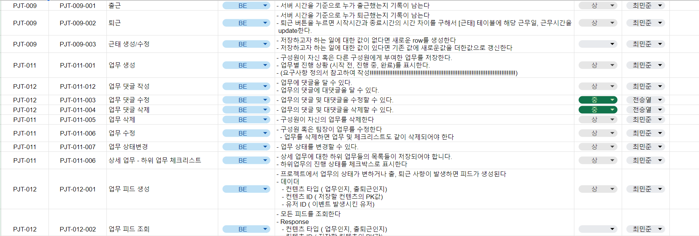
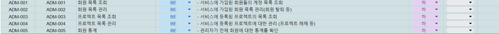
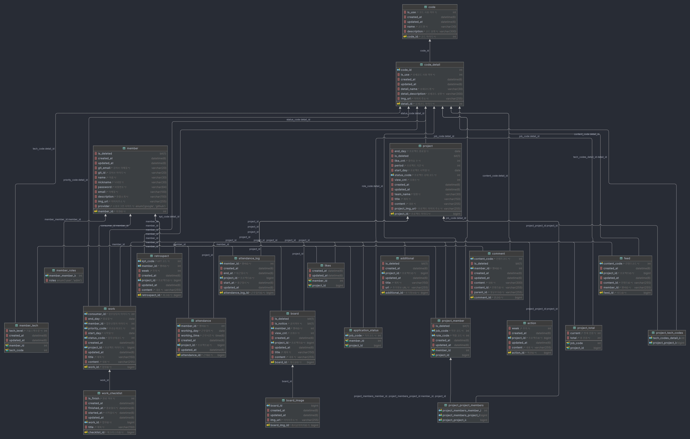

# Prog




# 목차

1. [개요](#1-개요)
2. [개발 환경](#2-개발-환경)
3. [서비스 화면](#3-서비스-화면)
4. [기술 소개](#4-기술-소개)
5. [설계 문서](#5-설계-문서)
6. [팀원 소개](#6-팀원-소개)

---

# 팀구성

<table>
  <tbody>
    <tr>
      <td align="center"><br /><sub><b>팀장 : 전승열</b></sub></a><br /></td>
      <td align="center"><br /><sub><b>BE 리더 : 최민준</b></sub></a><br /></td>
      <td align="center"><br /><sub><b>BE 팀원 : 최승준</b></sub></a><br /></td>
     <tr/>
      <td align="center"><br /><sub><b>FE 리더 : 정지원</b></sub></a><br /></td>
      <td align="center"><br /><sub><b>부팀장 : 박은수</b></sub></a><br /></td>
      <td align="center"><br /><sub><b>FE 팀원 : 백진규</b></sub></a><br /></td>
    </tr>
  </tbody>
</table>

# 1. 개요 

## 프로젝트를 생성해 팀원을 모집하고 프로젝트를 진행하며 협업을 위한 서비스를 제공한다.

### 프로젝트 생성
- 프로젝트의 제목, 설명, 프로젝트 기간, 사용 기술스택, 필요한 포지션등을 등록하여 프로젝트를 생성한다



### 프로젝트 신청
- 원하는 프로젝트의 특정 포지션에 지원한다
- 팀장은 프로젝트 신청 현황을 보고 수락/거절을 할 수있다.



### 프로젝트 관리
- 프로젝트 전반적인 진행 사항을 알 수 있다. 



  - 근태
    - 출/퇴근 버튼을 클릭하여 언제 몇시간동안 근무했는지 기록을 남길 수 있다.

  

  - 업무
    - 팀원 혹은 자신의 업무를 등록하여 프로젝트 관리를 수월하게 할 수 있다.

  

  - 피드
    - 업무
     - 업무 등록 및 피드 작성 등 프로젝트 내부에 발생한 이벤트들이 피드로 등록된다.

    
    
    - 자유
      - 프로젝트를 하며 필요한 문서, 공지 등을 게시글 형태로 등록할 수 있다.

    

  - 회고
    - KPT 회고 방식으로 한주동안 프로젝트를 진행하며 좋았던점, 아쉬운점, 시도해보고 싶은 점 등을 작성하고 다음주의 액션을 팀장이 설정 할 수 있다.
    
  

# 2. 개발 환경

### ⚙ Management Tool
     

### 🛠 IDE
   

### 🧲 Infra
    

### 🎨 FrontEnd
    

### 💻 BackEnd
    

# 3. 서비스 화면


# 4. 기술소개


## BackEnd
- Member
  - Security Filter와 JWT Token을 사용하여 API 요청 시 요청자의 권한을 검사한다.
  - OAuth2 인증을 이용해 깃허브 회원가입, 로그인, 계정 연동을 통해 불필요한 개인정보 최소화
  - Redis에 Acces Token과 Refresh Token을 관리해 유저가 로그아웃 요청 시 Refresh Token을 지우고 BlackList에 Acces Token을 저장해 Acces Token 탈취에 대한 대비
  - 자체 회원가입시 이메일 인증을 통해 무분별한 가입을 방지

- Code, CodeDetail
  - 공통으로 사용되는 값들을 정의해 DB에 부하를 줄였다.

- Attendance, Attendance_Log
  - 서버 시간을 기준으로 출/퇴근 시간을 기록
  - 퇴근 요청시 출근 시간과 비교해 업무 시간을 기록/합산 한다.

- Feed
  - 특정 이벤트에 Kafka Topic을 등록해 이벤트가 발생하면 피드를 저장하는 함수가 실행된다.


## FrontEnd
- Component
	- 분량이 길거나 다른 페이지에서도 사용하는 기능은 Component화 시켜서 재사용할 수 있도록 하였다.

- useUserStore
	- 사용자 프로필을 localStorage에 저장한 뒤 zustand를 통해 상태관리를 진행하여 Props를 사용하지 않고 모든 페이지에서 유저의 정보를 이용할 수 있게 하였다

- useAuthStore
	- 사용자별로 할당된 Access Token을 관리하는 useAuthStore Hook을 생성하여 Access Token을 모든 페이지에서 사용하여 접근할 수 있도록 하였다.

- axios.ts
	- zustand로 관리한 Access Token을 자동으로 api 요청의 Header에 담게 하여 Access Token의 노출 없이 api 요청을 보낼 수 있게 하였다.

- useActionQuery
	- react-query를 사용해 Action Data를 fetch할 수 있게 하였다.
	- Data Fetch 로직을 컴포넌트로부터 추상화하여 자동으로 Data를 fetch, cache할 수 있게 하였다.

- Recruit
	- 필터와 검색을 통해 프로젝트를 검색할 수 있게 하였다.
	- 각 프로젝트별로 사용자와 프로젝트의 관계를 파악해 참여 중인 프로젝트를 확인할 수 있게 하였다.

- Project
	- 멤버, 프로젝트 관리 등 관리자 권한이 필요한 기능을 zustand를 통해 권한을 부여하였다.


# 5. 설계 문서

- 요구사항 정의서


- 기능 명세서






- API 명세서
[PostMan API 명세서](https://documenter.getpostman.com/view/30927835/2s9YysENQb)

- ERD



- Figma
[피그마 링크](https://www.figma.com/file/YIy0Aw26vEYxUutiqowa2b/Gitit?type=design&node-id=3%3A2&mode=design&t=0aUrRt6N7vSDHLh8-1)


# 깃 컨벤션
## 브렌치 생성 컨벤션
- 브랜치 이름 생성 
  - 구분/commit type/기능명_지라 이슈 넘버 
    - be/feature/login_#72
    - fe/feature/login_#99
- 형상 관리
  - main : 기준이 되는 브랜치 (재품 배포)
  - dev : 개발 브랜치, 배포전 최종 확인
  - hotfix : 버그 수정
  - feature : 기능단위 개발
- 커밋 컨벤션
  - commit type
    - Feat : 기능 추가, 수정
    - Fix : 버그 수정
    - Docs : 문서 수정
    - Refactor : 기능 고도화
    - Style : 코드 포멧팅
    - Chore : 빌드 업무 수정
    - Design : UI 관련 코드
  ````
    제목 : [BE] Feat : Add security
    본문 : 시큐리티 설정 추가
    ````
# 6. 팀원 소개

|  |  |  |  |  |  |
|:---:|:---:|:---:|:---:|:---:|:---:|
| [전승열](https://github.com/jsy6265) | [최민준](https://github.com/hitobi1014) | [정지원](https://github.com/smarfy99) | [최승준](https://github.com/Mrrchoi) | [박은수](https://github.com/gardener-soul) | [백진규](https://github.com/qorwlsrb01) |
| Infra, 팀장 | BL | FL | Security | PM | UI |


